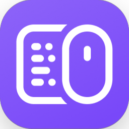

  
  <h1>Win32 Builder - Logitech Options Plus</h1>

## Configuring VSCode

### App Information
| Field | Data |
| --- | --- |
| Name | Logitech Options+ |
| Description | TBA |
| Publisher | Logitech |
| Information URL | TBA |
| Privacy URL | TBA |
| Category | Utilities & Tools |
| Logo | See Icon.png |

### Program

| Field | Data |
| --- | --- |
| Install Command | Install.cmd |
| Uninstall Command | Uninstall.cmd |
| Install Behaviour | System |

### Detection Rules

| Field | Data |
| --- | --- |
| Type | Registry |
| Key Path | HKEY_LOCAL_MACHINE\SOFTWARE\Microsoft\Windows\CurrentVersion\Uninstall\{850cdc16-85df-4052-b06e-4e3e9e83c5c6} |
| Value Name | DisplayVersion |
| Detection Method | Version Comparison |
| Operator | Equals |
| Value | _X.Y.Z_ |
| Associated with a 32-bit App | No |

